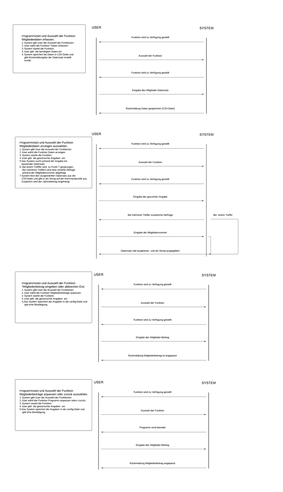

# Projekt_Mailer

Autoren: Kai Knezevic / Peter Meier / Stephan Fankhauser

## Inhaltsverzeichniss:

Projektbeschreibung:

Use Case:

Anleitung fürs Programm:

## Projektbeschreibung:

Im Rahmen dieses Projekts wird eine Software entwickelt, mit der Daten von Vereinsmitgliedern erfasst, verarbeitet und gespeichert werden können.

Die erfassten Informationen werden in einer CSV-Datei gespeichert. 
Zusätzlich bietet die Anwendung die Möglichkeit, Datensätze nach bestimmten Kriterien zu filtern und über die Kommandozeile auszugeben.

Die Software berücksichtigt verschiedene Mitgliederarten und zugehörige Mitgliederbeiträge.
Fehlerhafte Eingaben sollen automatisch erkannt und entsprechend behandelt werden.

Zusätzliche optionale Funktionen, wie das Generieren von E-Mails oder Druckadressen, erweitern den praktischen Nutzen der Anwendung.

## Anforderungen:
| Funktion                                                                   | Muss | Wunsch |
|----------------------------------------------------------------------------|------|--------|
| Daten erfassen                                                             | X    | -      |
| Daten in CSV-Datei speichern                                               | X    | -      |
| Daten filtern und als String mit Trennzeichen";"ausgeben                   | X    | -      |
| Falscheingaben abfangen                                                    | X    | -      |
| Mitglieder-Art zuweisen und Mitlieder-Beitrag definieren                   | -    | X      |
| Anhand des Datensatzes ein E-Mail generieren                               | -    | X      |
| Anhand des ausgegebenen Adressen-Strings eine druckbare Adresse generieren | -    | X      |
                                                             

## Use Case: 
- Mitgliederdaten erfassen und speichern
- Mitgliederdaten Auslesen
- E-mail versenden
  
Akteur: Vereinsmitarbeiter/in (z. B. Sekretariat)

Ziel: 
- Erfassung der Mitgliederdaten und Speicherung in der CSV-Datei
- Abruf der Mitgliederdaten
- (nur Erweiterung)Email versenden
  
Auslöser: 
- Ein neues Vereinsmitglied soll aufgenommen werden.
- Ein vorhandenes Mitglied kann gefiltert werden.
- (nur Erweiterung) An ein Mitglied soll eine E-mail versendet werden.

Vorbedingungen:
Die Software ist gestartet.

Ablauf einer Erfassung:
1. Der Benutzer wählt in der gegebenen Auswahl "Daten erfassen"
2. Der Benutzer des Programms gibt die persönlichen Daten der Mitglieder ein (Name, Adresse, Geburtsdatum etc.).
3. Die Mitgliederart wird ausgewählt (z. B. aktiv, passiv, Ehrenmitglied).
4. Nach Abschluss der Eingabe klickt der User auf „Speichern“.
5. Bei korrekter Eingabe wird der Datensatz in der CSV-Datei gespeichert.
6. Eine Bestätigung erscheint, dass der Datensatz erfolgreich gespeichert wurde.

Nachbedingungen:
Der neue Datensatz ist in der CSV-Datei vorhanden und korrekt formatiert.

Korrekturablauf:
Bei ungültigen Eingaben zeigt die Software eine entsprechende Fehlermeldung an, und der Benutzer kann die Eingabe korrigieren.

Ablauf einer Abfrage:
1. Der Benutzer wählt in der gegebenen Auswahl "Daten anzeigen"
2. Der Benutzer gibt ein Filterkriterium ein (Filterkriterium wird abgefragt) zur Identifikation der bestehender Mitglieder.
3. Die Software filtert die Mitgliederdaten entsprechend den eingegebenen Kriterien.
4. Die gefundenen Mitgliederdaten werden dem Benutzer angezeigt.
5. Die Software zeigt automatisch den entsprechenden Mitgliederbeitrag an.
6. (nur Erweiterung) Der Benutzer kann die angezeigten Daten bearbeiten oder weitere Aktionen ausführen (z. B. speichern, E-Mail senden).

Nachbedingungen:
Die gefilterten Mitgliederdaten werden korrekt angezeigt.

(nur Erweiterung) Ablauf der E-Mail-Erstellung:
1. Der Benutzer wählt in der gegebenen Auswahl "Ein Mail versenden"
2. Der Benutzer wählt das Mitglied aus, an das eine E-Mail gesendet werden soll.
3. Die Software erstellt automatisch eine E-Mail, basierend auf den zugewiesenen Mitgliedsdaten (z. B. Name, Beitrag).
4. Der Benutzer hat die Möglichkeit, den E-Mail-Inhalt zu überprüfen und anzupassen.
5. Die E-Mail wird an die hinterlegte Adresse der Mitglieder versendet.
6. Eine Bestätigungsmeldung erscheint, dass die E-Mail erfolgreich versendet wurde.

Nachbedingungen:
Die E-Mail wird erfolgreich versendet und an die angegebene Adresse der Mitglieder zugestellt.

## Anleitung fürs Programm:

Voraussetzungen:
- CLion (IDE von JetBrains)
- Compiler (z. B. GCC für Linux, MinGW für Windows oder Xcode Command Line Tools für macOS)
- Git (um Das Repository zu clonen)

Projekt herunterladen:
- Lade dir den Projektordner herunter. zip oder das Repository klonen, git clone[ https://github.com/bbz-software-engineering-sys23a/Projekt_Mailer.git
- Öffne CLion und wähle „Open Project“ → navigiere zum Ordner des Projekts und öffne ihn.

Programm ausführen:
- Am einfachsten lässt sich das Programm über die ZIP-Datei im Ordner Projekt_Mailer ausführen -> einfach die enthaltene .exe Datei starten.
  
oder
- Warte, bis CLion das Projekt vollständig indexiert hat.
- Klicke auf Build. oder ctr.F9 (Windows)
- Starte das Programm über das Pfeil Symbol oben rechts oder über Run.
  
oder
- Vorzugsweise wird das Programm über die Datei Projekt_Mailer.exe im Verzeichnis mailer/CMake/Build/Debug ausgeführt.
- Die Mitgliederliste wird anschließend in der Datei adresse.csv angezeigt.

  
## Flussdiagramm:

## Systemsequenzdiagramm:

End

